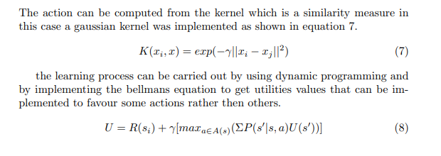
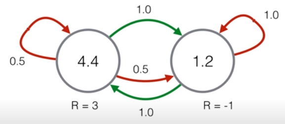

# Deep Utility Learning (DUN)

The following Reinforcement Learning algorithm was developed to train a bionic arm to recognise emg signals.
This is a reinforcement learning technique that implements kernels to calculate the action space 

Equation 8 is implemented to compute the utility scores of each state which in this case are the distance between the bionic hand and the desired movement.

This model assumes that the agent will find convergent utility values for each state, the following image shows an example of a convergent markov decision process:

Link to the full algorithm description can be found [here](Machine_Learning.pdf)
